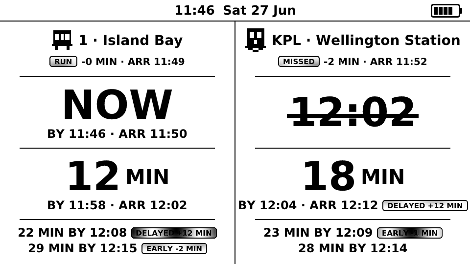
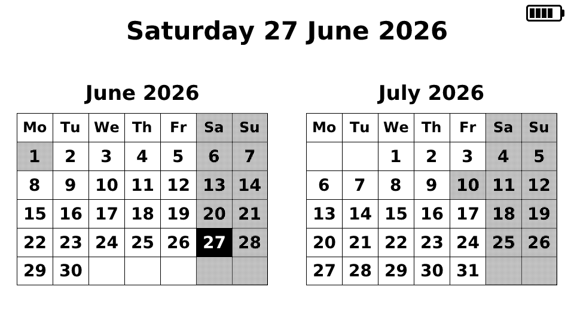
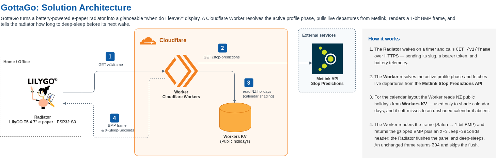

# GottaGo

> You're half-awake, crossing the kitchen at 7am. The bus leaves in four minutes. **Do you know that yet?**

GottaGo is a network of ambient e-ink transit radiators that answer the only question that matters in the morning rush: **when do I need to leave the house?**

Standard transit apps tell you when the bus *arrives*. That forces you to subtract your walk time, subtract how long you've been standing there, and decide whether to move — all before your first coffee. GottaGo removes that maths entirely. It tells you **LEAVE IN 7 MIN** and nothing else, glanceable from across the room, with zero taps, zero unlocking, zero squinting.

---

## What it looks like

*The screenshots below are live frames rendered straight off the Worker — real Metlink data, real battery telemetry, no mock-ups.*

### The morning commute — bus and train, side by side

The left column tracks the bus. The right tracks the train. The hero number is **LEAVE IN** — not arrival time — so there's no maths to do at 7am.

This frame also shows what happens when things go sideways, because reality rarely cooperates. The train's next departure is **cancelled**, struck through in place so the change is explained rather than silently dropped. Delayed and early departures wear `DELAYED` / `EARLY` chips, and the `RUN`/`MISSED` tags on the top row tell you whether the imminent service is still catchable. The unaffected column stays untouched, so the contrast itself tells you which side has the problem.

### Off-peak — a glanceable two-month calendar

Outside commute hours the radiator stops being a transit board and becomes ambient furniture. The dual-month calendar highlights today and shades weekends and New Zealand public holidays — here, King's Birthday (Mon 1 Jun) and Matariki (Fri 10 Jul) — a quiet, useful default for the hours when no bus matters.

### Idle — a dad joke to fill the gap

When there's genuinely nothing to show, the panel rotates through dad jokes rather than sitting blank. It's e-ink, so a joke costs zero power to keep on the wall.

The small battery indicator in the corner of every frame is rendered server-side from the voltage each radiator reports, so you can read the charge from across the room too.

---

## How it works

The architecture follows a single principle: **Dumb Radiator, Smart Edge**.

Each radiator — a 4.7" e-ink panel running on a LiPo battery, flush-mounted on a fridge or bedside surface — does exactly one thing: wake up, fetch a frame from the cloud, flush the raw pixels to the screen, and go back to sleep for 2–3 minutes.

All the work happens at the edge:

- A **Cloudflare Worker** (TypeScript) determines the active profile phase from server time, queries the Metlink Stop Predictions API, computes leave countdowns with walk time and comfort buffers, renders the full layout using [Satori](https://github.com/vercel/satori) and the DejaVu Sans Bold typeface, and encodes the result as a gzip-compressed 1-bit 960×540 BMP.
- The radiator receives the compressed frame, decompresses it, and flushes the raw byte array directly to the EPD panel buffer — no JSON parsing, no schedule logic, no maths.
- The Worker also returns the next sleep duration in an `X-Sleep-Seconds` header, so every scheduling decision lives at the edge — the firmware never evaluates a timetable. Metlink is queried uncached per frame, comfortably within its rate limit at household scale.

When Wi-Fi fails or the Worker is unreachable, the panel holds its last good frame indefinitely — e-ink consumes zero power to maintain an image.

### Hardware

Each radiator is built from three components (~$83 NZD total):

| Component | Part |
| --- | --- |
| Panel & board | [LilyGO T5 4.7" e-paper with ESP32-S3](https://github.com/Xinyuan-LilyGO/LilyGo-EPD47) |
| Power | 2000 mAh LiPo battery |
| Enclosure | Custom 3D-printed chassis with rear neodymium magnet slots |

The panel renders at native **960×540, 1-bit monochrome**, landscape. No backlight, no glow, no notification sounds. It blends into the room.

---

## Documentation

| Document | Description |
| --- | --- |
| [PRD](docs/PRD/GottaGo%20PRD.md) | Full product requirements, screen layout spec, functional & non-functional requirements |
| [UI/UX Design Reference](docs/UI/GottaGo%20-%20UI_UX%20Design%20Reference.md) | Screen scenarios, design rationale, do/don't build guidance |
| [OpenAPI 3.1 spec](docs/api/openapi.yaml) | Authoritative radiator ↔ Worker wire contract |
| [Glossary](docs/glossary.md) | Ubiquitous language — every term used in conversation, config, code, and docs |
| [Worker Architecture](docs/worker-architecture.md) | Canonical guide to how Worker code is built — pillars, gateway/feature/endpoint patterns, conventions, and the reasoning behind them |
| [Architecture Decision Records](docs/adr/README.md) | The *why* behind contested choices — indexed, with the lean-ADR style for new records |
| [Reference](docs/reference/) | External-contract detail too granular for an ADR — e.g. [Metlink stop predictions](docs/reference/metlink-stop-predictions.md) (field maps, sample payloads, verified stop IDs) |

---

## Built with an AI-assisted workflow

This project is developed using an AI-assisted engineering workflow powered by [Claude Code](https://claude.ai/code). Design decisions are captured as ADRs, the domain language is formalised in a living glossary, and the implementation is driven by vertical slices from the PRD — all in close collaboration with an AI agent.
