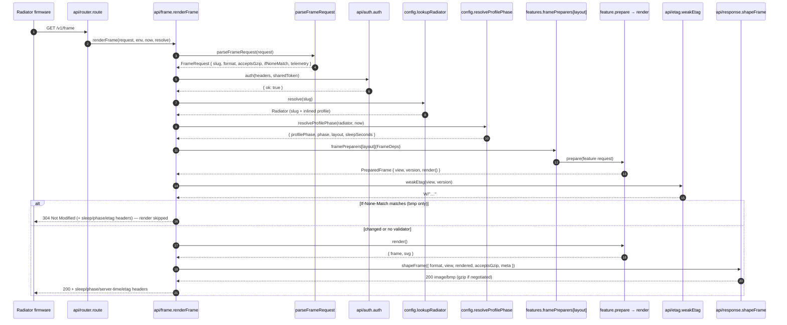

# Worker — `GET /v1/frame` request flow

Sequence diagram and component map for the production worker at
[`src/worker/`](../src/worker/). Use this to orient before jumping into the
code: it traces the one request the radiator ever makes, end to end.

**Scope vs. the architecture guide.** This doc is the _concrete request trace_ —
which file calls which, in what order, with today's names. The principles behind
the shape (Deep Modules, Feature Folders, REPR, the prepare/defer split) live in
the canonical [`docs/worker-architecture.md`](worker-architecture.md); read that
for _why_, this for _what happens_. Where they disagree, the code wins and both
docs are stale.

## Sequence diagram

Happy path, `Accept: image/bmp` (the radiator's path). The conditional-request
304 branch is shown inline; auth/slug failures, JSON/SVG diagnostics formats,
gzip negotiation, and the render-pipeline internals are in the component map
below.

## Component map

### Edge & routing

- **`index.ts`** — Worker entry. Builds `now` (a fresh `new Date()`, or the
  dev-only `X-Debug-Now` override via `debug/dev-time.ts`) and calls
  `route(request, env, now)`. This is the only place "now" and Cloudflare
  bindings enter the system; everything downstream takes them as parameters,
  which keeps phase/viewmodel logic trivially testable.
- **`api/router.ts` (`route`)** — Single-route dispatcher. Matches
  `GET /v1/frame`; everything else → `notFoundResponse`. One branch point: a
  `test-` prefixed slug routes to `handleTestFrame` (synthetic scenario, GH #21),
  every real slug to `handleFrame`. Both flow through the same `renderFrame` core.
- **`api/frame.ts`** — The endpoint. `handleFrame` / (and `api/test-frame.ts`'s
  `handleTestFrame`) are thin shims that inject a `RadiatorResolver`; the real
  work is `renderFrame`, the branch-free core that runs Request → Endpoint →
  Response. If you're looking for "what happens on a frame request", start here.
- **`api/frame-request.ts` (`parseFrameRequest`)** — Parses the raw `Request`
  once into the `FrameRequest` the orchestrator works with: slug, negotiated
  `format`, `includeBmp`, `acceptsGzip`, the `If-None-Match` validator, and
  telemetry headers. `extractObservabilityInfo` derives the context (slug,
  hardwareId, requestId, batteryMv) spread into every log line.

### Gatekeeping

- **`api/auth.ts` (`auth`)** — Compares `X-Radiator-Token` against
  `env.RADIATOR_SHARED_TOKEN`. Returns a deliberately opaque
  `{ ok: true } | { ok: false }` — missing-token and wrong-token are
  indistinguishable at the type level, per the OpenAPI contract.
- **`config/lookup.ts` (`lookupRadiator`)** — Resolves a slug to a fully
  populated `Radiator` (slug + inlined profile) by joining `RADIATOR_REFS`
  (slug → profile-name) against `PROFILES`. Fails closed (→ undefined → 404) on
  an unknown slug or a dangling profile-name reference.
- **`config/data.ts`** — `GLOBAL` (timezone, default refresh,
  `stopPredictionLimit`), `PROFILES`, `RADIATOR_REFS`, and `SYSTEM_IDLE_DEFAULT`.
- **`config/config-types.ts`** — `Global`, `Radiator`, `Profile`, `ProfilePhase`
  types. Type-only imports `LayoutKey` from `features/frame-registry` so the
  configured layout union can't drift from the registered set.

### Phase resolution

- **`config/resolve.ts` (`resolveProfilePhase`)** — Maps `(radiator, now)` to the
  active **profile phase**, its `layout`, and the clamped sleep duration
  (`[30, 14400]` s). Picks the phase whose half-open `[startTime, endTime)`
  window contains the local wall-clock time _and_ whose active `days` include
  today (ADR-0015); the active sleep is the refresh interval truncated at the
  next phase boundary. Outside every window it falls through to the **idle
  profile** (ADR-0003 / #17), sleeping until the next phase opens (capped at 4h).
  Returns `{ profilePhase, phase, layout, sleepSeconds }` — `layout` indexes the
  registry, `profilePhase` is the `X-Profile-Phase` header, `sleepSeconds` is
  `X-Sleep-Seconds`.

### Feature dispatch

- **`features/frame-registry.ts`** — The composition root. `framePreparers` maps
  each `LayoutKey` to a **binder** that turns the per-request `FrameDeps` bundle
  (assembled once in `renderFrame`) into the feature's own request — binding
  gateway capabilities to transport (`fetch`, env bindings) and collapsing format
  negotiation into `includeBmp` / `includeSvg` flags. `LayoutKey` is the source of
  truth (consumed by `config-types.ts`); the `satisfies Record<LayoutKey,
  FramePreparer>` proves the registry covers exactly the implemented layouts.
  Today: `minimal_clock`, `priority_split`, `idle_jokes`, `dual_month_calendar`.

### Per feature

Each layout is one folder under `features/<layout>/` exposing **one REPR
capability** — `prepare<Layout>Frame(req) → Promise<{ view, version, render }>`:

- **`view`** — the cheap JSON projection (diagnostics body + ETag input).
- **`version`** — the `LAYOUT_VERSION` appearance revision (ETag input).
- **`render()`** — a deferred closure over the private view model that produces
  the expensive artefacts (`{ frame, svg }`), each non-null only when the format
  needs it. Deferring lets the 304 path skip rasterisation entirely (ADR-0013).

The folder splits by role: `<capability>.ts` (contract + re-export),
`<capability>-impl.ts` (fetch → map → derive → compose), `viewmodel.ts`
(private VM + `toJsonView`), `view.tsx` (renderer + `LAYOUT_VERSION`), plus
`errors.ts` / `domain-service.ts` when earned. The four today, by complexity:
`minimal_clock` (no gateway, pure wall-clock), `idle_jokes` (one gateway, throws
on failure), `priority_split` (parameterised Metlink calls + domain service),
`dual_month_calendar` (soft-misses a public-holidays KV gap into an unshaded
calendar). The feature never sees `fetch`, `Env`, or a wire format.

### Gateways

Features reach every external system through a **gateway** under
`gateways/<system>/` — one public capability (`fetchArrivals`, `fetchJoke`,
`fetchHolidays`) reporting failure as data (`{ ok, error }`), with the wire
format quarantined in `mapper.ts`. The registry binders supply transport; the
feature's impl decides what a failure _means_ (throw vs. soft-miss).

### Conditional frame (304)

- **`api/etag.ts`** — `weakEtag(view, version)` derives the weak validator
  (FNV-1a 64-bit over `version + JSON.stringify(view)`) from the feature's cheap
  outputs — never the rendered bytes — so a 304 can be answered before rendering.
  `ifNoneMatchSatisfied` does the RFC 9110 weak comparison. `renderFrame` checks
  this only on the `bmp` path (`isUnchangedFrame`); JSON/SVG diagnostics always
  return 200. Generation and validation share one module, so they can't drift
  (ADR-0013 / #73).

### Content negotiation & response shaping

- **`api/format.ts` (`resolveResponseFormat`)** — Accept header → `'bmp'` (radiator,
  or no Accept) / `'json'` / `'svg'` (diagnostics surfaces, ADR-0004).
- **`api/response.ts`** — `shapeFrame` owns per-format encoding over the narrow
  leaf shapers: `frameJsonResponse` (envelope, never gzipped), `frameSvgResponse`
  and `frameBmpResponse` (gzipped via `frameBody` when the client advertised it),
  and `frameNotModifiedResponse` (the bodiless 304). `frameBody` sets
  `encodeBody: 'manual'` whenever it gzips, so the Workers runtime doesn't
  double-encode an already-compressed body (GH #13). `FrameMeta` (sleep, server
  time, profile phase, etag) rides every 200 and the 304 identically (ADR-0003).
- **`api/envelope.ts` (`buildFrameEnvelope`)** — Assembles the JSON diagnostics
  envelope: cross-cutting fields (`profile_phase`, `layout`, `server_time`) plus
  the layout's view model, appending `frame_bmp_base64` only on `?include_bmp=1`.

### Render pipeline (shared)

- **`shared/satori.ts`** — Cold-start defence. `satori/standalone` does **not**
  auto-fire yoga's wasm compile on module load (GH #14); both `yoga.wasm` and
  resvg's `index_bg.wasm` are imported as pre-compiled `WebAssembly.Module`s and
  instantiated by a per-isolate memoized `ensureWasm()` on first request. Exposes
  `jsxToSvg(tree)` and `svgToRgba(svg)`, each `await`ing `ensureWasm()` first.
- **`shared/bmp.ts` (`rgbaTo1BitBmp`)** — RGBA → 1-bpp BMP encoder. Luminance
  threshold 128, top-down, no compression; constant output at 960×540. The single
  source of truth for `WIDTH` / `HEIGHT`.
- **`shared/gzip.ts`** — Thin `CompressionStream('gzip')` wrapper, invoked only
  when the client advertises gzip (ADR-0001).

### Errors

- **`api/failure.ts` (`failureResponse`)** — The pipeline's failure boundary
  (ADR-0011). The `renderFrame` `catch` routes every throw here: known
  `AppError`s pass through, anything else becomes `internal`; it logs (with the
  raw stack for unknowns) and delegates to `problemResponse`. No re-throw, so CF
  never sees a bare 500. Retryable errors sleep at the resolved phase's duration.
- **`api/errors.ts`** — `problemResponse` shapes an `AppError` into RFC 9457
  `application/problem+json` with `X-Sleep-Seconds` / `X-Profile-Phase` headers
  (used for the 401/404 auth/slug failures). `notFoundResponse` is the class-less
  router-level 404 for an unknown path — a developer/curl condition the radiator
  never hits.
- **`shared/errors.ts`** — The `AppError` class and the closed `ProblemSlug`
  union (the typed mirror of `docs/api/errors.md`), plus the factory functions
  (`unauthorizedError`, `unknownRadiatorError`, `internalError`, …).

## Mental shortcut

> A frame request is **parse → gate → resolve → prepare → (304?) → render → shape**.
> Parse in `api/frame-request`. Gate in `api/auth` + `config/lookup`. Resolve the
> phase in `config/resolve`. Dispatch + prepare via `features/frame-registry`
> (layout key → binder → the feature's deferred `{ view, version, render }`).
> Compute the ETag (`api/etag`) and short-circuit to a 304 if it still matches —
> skipping render entirely. Otherwise `render()` the artefacts and `shapeFrame`
> the negotiated format (`api/response`), gzipping per `shared/gzip`. Any throw
> lands in `api/failure`.
> The two non-obvious bits — `satori/standalone` + memoized `ensureWasm`
> ([#14](https://github.com/philipf/gotta-go/issues/14)) and `encodeBody: 'manual'`
> ([#13](https://github.com/philipf/gotta-go/issues/13)) — both have inline
> comments pointing at the GitHub issues.
