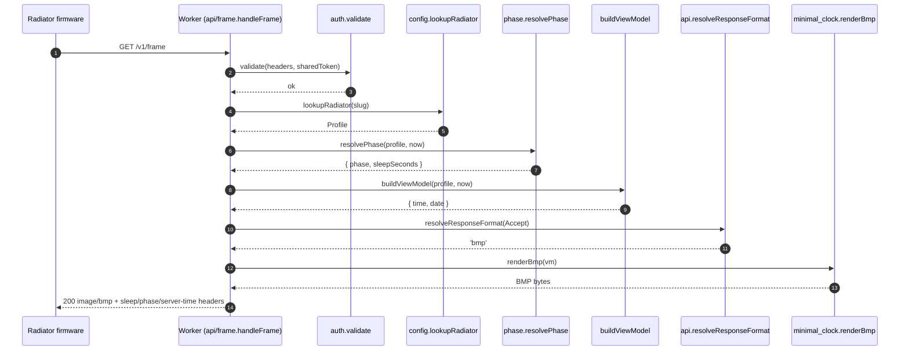

# Worker — `GET /v1/frame` request flow

Sequence diagram and component map for the production worker at [`src/worker/`](../src/worker/). Use this to orient before jumping into the code.

## Sequence diagram

Happy path only — auth/slug failures, gzip negotiation, and the render-pipeline internals are covered in the component map below.

## Component map

### Edge & routing

- **`index.ts`** — Worker entry. Calls `route(request, env, new Date())`. The `new Date()` injection point is the only place "now" enters the system; everything downstream takes `now: Date` as a parameter, which keeps phase/viewmodel logic trivially testable.
- **`api/router.ts`** — Single-route dispatcher. Matches `GET /v1/frame` → `handleFrame`; everything else → 404. Knows zero domain.
- **`api/frame.ts` (`handleFrame`)** — The only "thick" function in `api/`. It orchestrates the slice: auth → config → schedule → viewmodel → render → gzip → response. If you're looking for "what happens on a frame request", start here.

### Gatekeeping

- **`auth/index.ts` (`validate`)** — Constant-comparison of `X-Radiator-Token` against `env.RADIATOR_SHARED_TOKEN`. Returns a deliberately opaque `{ ok: boolean }` — missing-token and wrong-token are indistinguishable on the wire (per the OpenAPI contract).
- **`config/index.ts` (`lookupRadiator`)** — Looks up a `Profile` by slug in the in-memory `RADIATORS` map (`config/data.ts`). For #4 the only seeded radiator is `bedroom-philip-tania`. This is where the multi-radiator config will land.

### Domain (per feature)

- **`features/minimal_clock/phase.ts` (`resolvePhase`)** — Picks the active phase and clamps `refreshIntervalMinutes × 60` into `[30, 14400]` seconds. The #4 config has a single all-day phase, so phase resolution is trivial. The file comment notes this lifts up to `schedule/index.ts` once multi-phase + DST logic lands with issue #5.
- **`features/minimal_clock/viewmodel.ts` (`buildViewModel`)** — Pure presentation layer: formats `time` (`HH:MM`, 24h, en-GB) and `date` (`Dow DD Mon`) in the profile's timezone via `Intl.DateTimeFormat`, with a per-tz cache so we don't rebuild formatters per request. No date library.
- **`features/minimal_clock/bmp.tsx` (`renderBmp`)** — The renderer for `image/bmp`. Builds the JSX layout (centered time + date in Press Start 2P), then walks the three-stage pipeline: JSX → SVG → RGBA → 1-bpp BMP.
- **`features/minimal_clock/index.ts`** — Exports the `renderers` map keyed by `ResponseFormat`. Today: `{ bmp: renderBmp }`. When `json` / `svg` outputs land (#19 / #20), they slot in alongside `bmp`.

### Content negotiation

- **`api/format.ts` (`resolveResponseFormat`)** — Accept header → response format. For #4 it unconditionally returns `'bmp'`. Stub on purpose; ADR-0004 specifies the `json` / `svg` branches that arrive with later issues.

### Render pipeline (shared)

- **`shared/satori/index.ts`** — The crown jewel of cold-start defence. Three things to know:
  1. `import satori, { init as initSatori } from 'satori/standalone'` — the standalone entry does **not** auto-fire yoga's WASM compile on module load (GH #14).
  2. `yoga.wasm` and resvg's `index_bg.wasm` are imported as values; wrangler/esbuild treat them as `WebAssembly.Module`s pre-compiled at deploy time.
  3. `ensureWasm()` is a per-isolate memoized `Promise.all([initSatori(yogaWasm), initResvg(resvgWasm)])` — both wasms instantiate lazily, in parallel, exactly once.

  Exposes `jsxToSvg(tree)` and `svgToRgba(svg)`. Both `await ensureWasm()` before doing work.
- **`shared/bmp/index.ts` (`rgbaTo1BitBmp`)** — RGBA → 1-bpp BMP1 encoder. Luminance threshold 128 (with alpha-over-white compositing), top-down (negative height), BI_RGB (no compression). Emits the 14-byte file header + 40-byte DIB + 8-byte 2-colour palette + packed bit rows. Output is a constant 64 862 bytes at 960×540. Also the single source of truth for `WIDTH` / `HEIGHT`.

### Wire-level encoding

- **`shared/gzip/index.ts`** — Thin `CompressionStream('gzip')` wrapper. Only invoked when the client advertises gzip. Returns ~1.5 KB for our 64 862-byte BMP (≈40× saving).
- **`api/response.ts` (`frameOk`)** — Final response shaper. Sets `Content-Type: image/bmp` and the three ADR-0003 observability headers (`X-Sleep-Seconds`, `X-Server-Time`, `X-Profile-Phase`). When `gzip=true`, also sets `Content-Encoding: gzip` **and** the non-standard `encodeBody: 'manual'` — that flag is the GH #13 fix and tells the Workers runtime "the body is already encoded, don't re-gzip it." The two settings are bound to the same boolean so they cannot drift apart.

### Errors

- **`api/errors.ts`** — Centralised 401 / 404 shapers. Both set `X-Sleep-Seconds: 3600` (the firmware backs off for an hour on auth/slug failures) and `X-Profile-Phase: none`. Bodies are short lowercase strings; the firmware ignores them — status code drives behaviour.

## Mental shortcut

> A frame request is **gate → resolve → render → encode → shape**.
> Gate in `auth/` + `config/`. Resolve in `features/<feature>/phase` + `viewmodel`. Render via `resolveResponseFormat` + the feature's `renderers` map. Encode in `shared/gzip`. Shape in `api/response`.
> The two non-obvious bits — `satori/standalone` + memoized `ensureWasm` ([#14](https://github.com/philipf/gotta-go/issues/14)), and `encodeBody: 'manual'` ([#13](https://github.com/philipf/gotta-go/issues/13)) — both have inline comments pointing at the GitHub issues.
